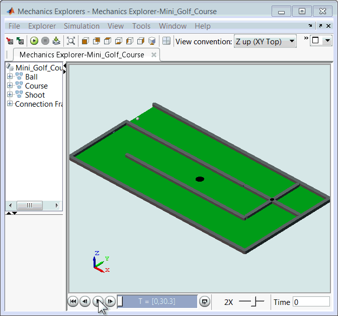

# **Simscape Multibody Mini Golf Library**
Copyright 2015-2023 The MathWorks(TM), Inc.

View on File Exchange:   
You can also open in MATLAB Online: 

This library contains components for modeling a mini golf course.  It includes
fixed walls, moving walls, posts, spinning obstacles, putting head, and the hole.
A nine-hole course is provided, where the hole to be played can be selected
using configurable subsystems. 

Open Mini_Golf_Library.prj to begin.  This sets up the path and opens the mini golf game.
To change holes, select a different block choice for the Course subsystem.
Instructions for playing the game are in Simscape_Multibody_Mini_Golf_Game_PDF.pdf
in the Slides_Recordings subdirectory.

This library uses the Simscape Multibody Contact Forces Library, which is
included in this submission.  Additional contact force examples
are included with the Simscape Multibody Contact Forces Library submission
on the MATLAB Central File Exchange.

